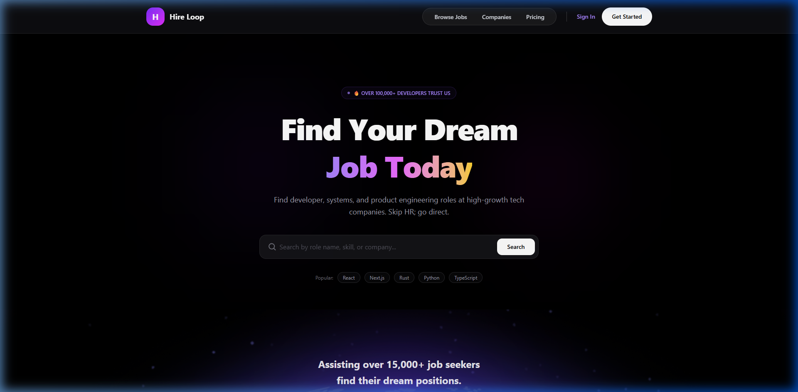
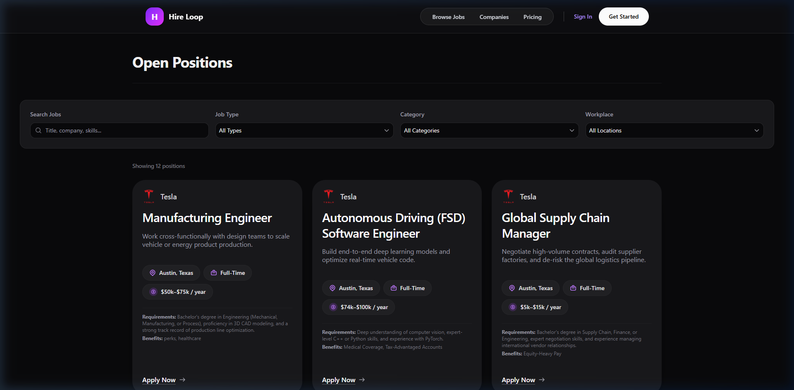
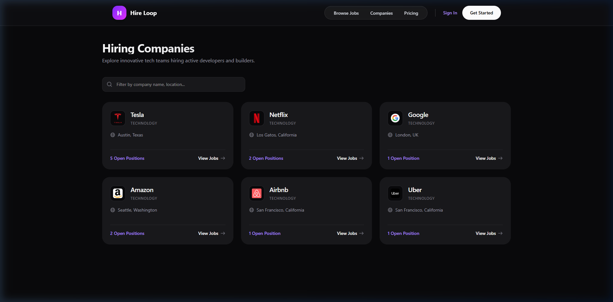
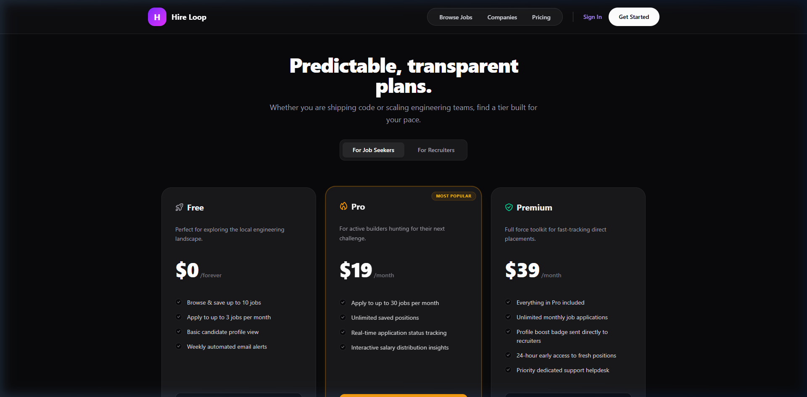

# HireLoop 🌀
### **The AI-Native Career Platform & Technical Job Marketplace**



---

## 🔗 Live Application Links

- **Frontend App:** [https://hire-loop-client-eta.vercel.app](https://hire-loop-client-eta.vercel.app)
- **Backend API:** [https://hire-loop-server-theta.vercel.app](https://hire-loop-server-theta.vercel.app)

---

HireLoop is a premium, full-featured career portal designed to bridge the gap between job seekers and employers. Built with a modern, high-performance tech stack, it features role-based dashboards, a custom applicant tracking system (ATS), Stripe-integrated subscription tiers, and a refined glassmorphism design system.

---

## 🚀 Key Features

### **1. Public Job Board & Discovery**
- **Smart Search & Filters:** Filter roles dynamically by job type (Full-time, Part-time, Remote, Contract, Internship), salary bracket, category, and remote status.
  
  

- **Company Profiles Directory:** A dedicated space showing registered and verified teams, active headcount, and public job postings.
  
  

- **Dynamic Pricing Portal:** Distinct subscription plans for Seekers and Recruiters with secure Stripe checkouts.
  
  

### **2. Role-Based Dashboards**
- **👤 Seeker Dashboard:** 
  - Dynamic metrics overview (Applications, Saved, Interviews, Offers).
  - Relative-time applications tracking table.
  - Interactive profile customizer (upload resume, skills, headline, biography).
- **🏢 Recruiter Dashboard:**
  - Company registrations system (requires Admin approval to list publicly).
  - Job publishing form with limit checks based on plan tier.
  - Applicant pipeline editor (Move candidates dynamically: *Applied ➔ Under Review ➔ Shortlisted ➔ Offered / Rejected*).
- **🛠️ Admin Panel:**
  - Platform metrics and financial analytics dashboard.
  - Corporate registration vetting (Approve/Reject company listings).
  - User permission controls (make recruiter, seeker, or suspend accounts).

---

## 🛠️ Tech Stack & Architecture

- **Frontend:** Next.js (App Router & React Server Components), Tailwind CSS, HeroUI
- **Database:** MongoDB (utilizing native MongoDB adapters)
- **Authentication:** Better-Auth (with secure token/session propagation)
- **Payments:** Stripe Checkout & Subscription API
- **Motion:** Motion library for fluid card transitions and dashboard interactions
- **Backend Service:** Node.js & Express REST API (running on port 5000)

---

## 📂 Repository Structure

- `src/app/` — Next.js routing structure (pages, API handlers, layout templates)
- `src/components/` — Modular, reusable React layout blocks (Hero, Stats, Featured, Navbar, Footer)
- `src/lib/` — Better-Auth, Stripe configuration, client utilities, and database API actions

---

## ⚙️ Running Locally

Follow these steps to launch the system in your local workspace:

### 1. Configure Environmental Variables (`.env`)
Create a `.env` in the root of the client folder:
```env
BETTER_AUTH_SECRET=your_auth_secret
BETTER_AUTH_URL=http://localhost:3000
MONGO_DB_URI=your_mongodb_connection_uri
AUTH_DB_NAME=hireloop-db
NEXT_PUBLIC_BASE_URL=http://localhost:5000
NEXT_PUBLIC_IMAGE_UPLOAD_API=your_imgbb_or_cloudinary_key
NEXT_PUBLIC_STRIPE_PUBLISHABLE_KEY=your_stripe_pub_key
STRIPE_SECRET_KEY=your_stripe_secret_key
```

### 2. Install Dependencies
```bash
npm install
```

### 3. Run Development Server
```bash
npm run dev
```
Open [http://localhost:3000](http://localhost:3000) to view the application.
